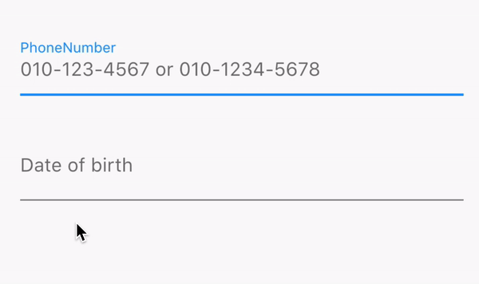

# multi_masked_formatter

Multple Masked TextInputFormatter Flutter plugin.
It is useful for entering phone numbers, date of birth.



## Getting Started

### Dependency
```
dependencies:
  multi_masked_formatter: ^1.0.0
```

### Import
```
import 'package:multi_masked_formatter/multi_masked_formatter.dart';
```

### Example
```
TextField(
  inputFormatters: [
    MultiMaskedTextInputFormatter(
        masks: ['xxx-xxxx-xxxx', 'xxx-xxx-xxxx'], separator: '-')
  ],
  autofocus: true,
  keyboardType: TextInputType.number,
  decoration:
      InputDecoration(
        labelText: 'PhoneNumber',
        hintText: '010-123-4567 or 010-1234-5678'),
);
  
  
TextField(
  inputFormatters: [
    MultiMaskedTextInputFormatter(
        masks: ['xx.xx.xx', 'xxxx.xx.xx'], separator: '.')
  ],
  autofocus: true,
  keyboardType: TextInputType.number,
  decoration: InputDecoration(
      labelText: 'Date of birth', hintText: '99.02.20 or 1999.02.20'),
);
```
